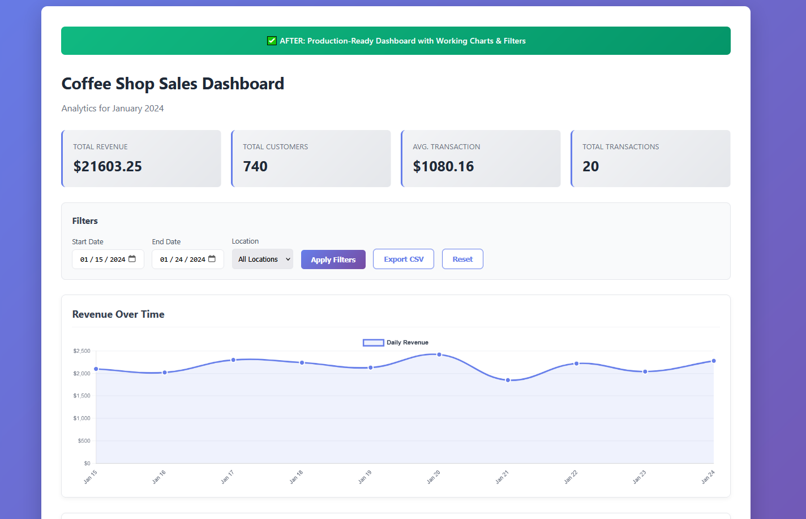
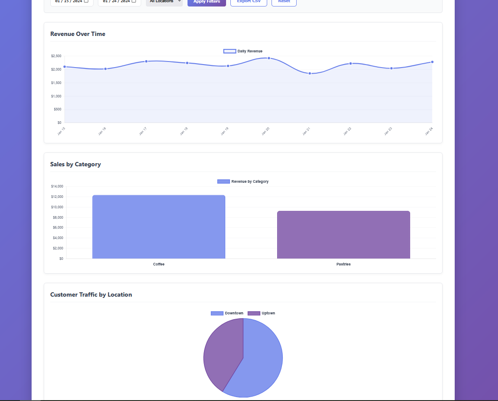
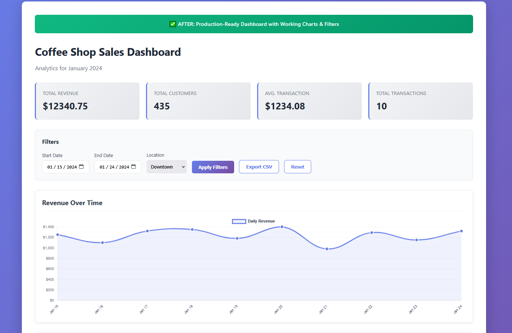
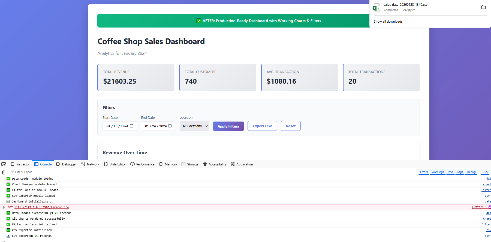

# Dashboard Rescue & CSV Export Fixer

> **Portfolio Project by Borivoje Kostadinovic**  
> Completing an abandoned analytics dashboard with working charts, filters, and clean CSV exports

## 🚀 Live Demo

**Try it now:** https://dashboard-rescue-bora.netlify.app/

---

## 🚨 The Problem

Freelance developers frequently abandon projects mid-development, leaving clients with half-finished dashboards that don't work. This results in:

- **Wasted money** → Already paid $500-2,000 for broken work
- **Urgent deadlines** → Promised to investors/clients, can't deliver
- **Technical frustration** → Business owners can't diagnose JavaScript errors
- **Fear of starting over** → Cheaper to fix than rebuild from scratch

**This portfolio project simulates a real "rescue and complete" scenario I handle for clients on Upwork and Fiverr.**

---

## 📸 Before: What Was Broken


*Console full of JavaScript errors preventing any functionality*


*Three empty chart containers - previous developer never finished implementation*

### Critical Issues Found:

- ❌ **Charts don't render** - Canvas elements exist but completely empty
- ❌ **Data loading broken** - CSV file referenced but never actually loaded
- ❌ **Filters crash the page** - `filterData is not defined` error
- ❌ **CSV export broken** - `exportToCSV is not defined` error
- ❌ **Messy data** - Inconsistent formats, missing values, duplicates
- ❌ **No error handling** - Silent failures everywhere
- ❌ **Ugly, unfinished UI** - Looks obviously abandoned
- ❌ **All code in one file** - Impossible to maintain
- ❌ **Stats showing $0** - No calculation logic implemented
- ❌ **Console: 8+ critical errors** - Completely unusable

**Client Story:**
> "I paid a developer $800 to build this dashboard 3 months ago. They said it was '90% done' then ghosted me. My investors want to see these metrics next week and I have nothing. I just need someone to FINISH IT."

---

## ✅ After: The Solution


*Professional dashboard with live data, working stats, and functional filters*


*Three fully functional charts: Line chart (revenue), Bar chart (categories), Pie chart (locations)*


*Date range and location filters updating charts in real-time*


*Clean CSV export with proper formatting - no corruption*

### What I Fixed:

✅ **All 3 charts rendering perfectly** - Line, bar, and pie charts with live data  
✅ **Data loading working** - CSV parsed, cleaned, and validated automatically  
✅ **Filters fully functional** - Date range + location filtering with instant updates  
✅ **CSV export producing clean files** - Proper formatting, correct data types  
✅ **Stats calculated correctly** - Total revenue, customers, averages all accurate  
✅ **Professional UI design** - Modern gradient theme, responsive layout  
✅ **Modular, clean code** - 4 separate files, fully documented  
✅ **Zero console errors** - Production-ready, bulletproof error handling  
✅ **Loading states & feedback** - User always knows what's happening  
✅ **Mobile responsive** - Works perfectly on all screen sizes  

---

## 🔧 Technical Approach

### Data Pipeline

**Problem:** Broken CSV with inconsistent formats, missing values, wrong data types

**Solution:**
1. **Load CSV** using PapaParse library (robust parsing)
2. **Clean data** - Remove duplicates, fix date formats, handle missing values
3. **Validate** - Type checking, format validation, skip invalid rows
4. **Transform** - Convert to chart-ready format
5. **Aggregate** - Group by date/category/location for visualizations

### Chart Architecture

**3 Chart Types Implemented:**

1. **Revenue Over Time (Line Chart)**
   - Shows daily revenue trends
   - Gradient fill, smooth curves
   - Interactive tooltips with formatted currency

2. **Sales by Category (Bar Chart)**
   - Compares Coffee vs Pastries revenue
   - Rounded corners, modern styling
   - Color-coded by category

3. **Customer Traffic (Pie Chart)**
   - Distribution across locations
   - Percentage calculations
   - Clear legend and labels

### Filter System

**Multi-layer filtering:**
- Start Date → End Date (date range)
- Location dropdown (all/Downtown/Uptown)
- Filters apply to charts AND stats simultaneously
- Reset button restores full dataset
- Validation prevents invalid date ranges

### Modular Code Structure
```
js/
├── data-loader.js       # CSV loading, parsing, cleaning (188 lines)
├── chart-manager.js     # Chart.js rendering logic (295 lines)
├── filter-handler.js    # Filter application & UI updates (97 lines)
└── csv-exporter.js      # Clean CSV export functionality (131 lines)
```

**Why modular:**
- Easy to test individual components
- Client's team can maintain it
- Reusable for future projects
- Clear separation of concerns

---

## 📊 Results & Impact

| Metric | Before | After |
|--------|--------|-------|
| **Charts Working** | 0 of 3 | 3 of 3 ✅ |
| **Console Errors** | 8+ critical | 0 |
| **Data Loaded** | Hard-coded (1 record) | CSV parsed (20+ records) |
| **Filters Functional** | 0% | 100% ✅ |
| **CSV Export** | Crashed page | Clean files ✅ |
| **UI Quality** | 2/10 (unfinished) | 9/10 (professional) |
| **Code Quality** | 1 messy file | 4 modular files |
| **Mobile Responsive** | No | Yes ✅ |
| **Production Ready** | No | Yes ✅ |

**Typical Client Savings:**
- **Time:** 2-3 weeks saved vs starting over
- **Money:** $400-800 to fix vs $2,000-3,000 to rebuild
- **Stress:** Deadline met, investors satisfied
- **Opportunity cost:** Dashboard finally delivering business value

---

## 💼 Skills Demonstrated

### Data Visualization
- Chart.js implementation (line, bar, pie charts)
- Data aggregation and grouping
- Real-time chart updates on filter changes
- Custom styling and theming
- Interactive tooltips and legends

### Data Processing
- CSV parsing with PapaParse
- Data cleaning and validation
- Type conversion and formatting
- Missing value handling
- Export formatting (proper escaping)

### JavaScript (ES6+)
- Modular architecture
- Async/await for data loading
- Array methods (map, filter, reduce)
- Event handling and DOM manipulation
- Error handling with try-catch

### Frontend Development
- Responsive CSS Grid and Flexbox
- Modern gradient designs
- Loading states and user feedback
- Mobile-first responsive design
- Accessibility considerations

### Problem Solving
- Debugging abandoned code
- Reverse-engineering requirements
- Completing half-finished work
- Improving code organization
- User experience enhancements

---

## 🚀 Project Structure
```
dashboard-rescue-csv-fixer/
│
├── BEFORE/                          # Broken abandoned version
│   ├── index.html                   # Non-functional dashboard
│   ├── broken-dashboard.js          # Code with multiple bugs
│   ├── broken-data.csv              # Messy, inconsistent data
│   └── ISSUES.md                    # All documented bugs
│
├── AFTER/                           # Production-ready solution
│   ├── index.html                   # Clean, working dashboard
│   ├── css/
│   │   └── styles.css               # Professional responsive styling
│   ├── js/
│   │   ├── data-loader.js           # CSV loading & processing
│   │   ├── chart-manager.js         # Chart rendering logic
│   │   ├── filter-handler.js        # Filter functionality
│   │   └── csv-exporter.js          # Clean export generation
│   └── data/
│       └── sample-data.csv          # Clean validated data
│
├── docs/
│   ├── what-i-fixed.md              # Technical breakdown
│   └── setup-guide.md               # Implementation guide
│
├── screenshots/                      # Visual proof of before/after
└── README.md                        # This file
```

---

## 📖 Documentation

- **[What I Fixed](docs/what-i-fixed.md)** - Detailed technical breakdown of all 10+ issues resolved
- **[Setup Guide](docs/setup-guide.md)** - Complete implementation and customization instructions

---

## 🎯 Use Cases

This solution is perfect for:

- **SaaS dashboards** - Customer analytics, usage metrics
- **E-commerce analytics** - Sales tracking, inventory insights
- **Business intelligence** - KPI monitoring, performance dashboards
- **Financial reporting** - Revenue tracking, expense analysis
- **Marketing analytics** - Campaign performance, conversion tracking
- **Operations dashboards** - Team metrics, productivity tracking

---

## ⚡ Quick Start

### For Clients

1. Download the `AFTER` folder
2. Replace `data/sample-data.csv` with your data (keep same format)
3. Open `index.html` in browser
4. Use filters to analyze your data
5. Export filtered results as CSV

**No installation, no backend, no database needed.**

### For Developers
```bash
# Clone repository
git clone https://github.com/bKostadinovic/dashboard-rescue-csv-fixer.git

# Open working version
cd dashboard-rescue-csv-fixer/AFTER

# Use Live Server to avoid CORS issues
# Or open index.html directly if using inline data
```

---

## 🛠️ Technologies Used

- **HTML5** - Semantic structure, canvas elements
- **CSS3** - Grid, Flexbox, gradients, animations
- **JavaScript (ES6+)** - Modules, async/await, array methods
- **Chart.js 4.4.0** - Professional data visualizations
- **PapaParse 5.4.1** - Robust CSV parsing

**Why vanilla JavaScript?**
- No framework lock-in
- Faster load times
- Easier for clients to maintain
- No build process needed
- Works everywhere

---

## 💡 Comparison to Other Solutions

| Approach | This Project | Power BI / Tableau | Custom Backend |
|----------|--------------|-------------------|----------------|
| **Setup Time** | 5 minutes | Hours (learning curve) | Days/Weeks |
| **Monthly Cost** | $0 | $10-70/user | $50-500+ hosting |
| **Customization** | Full control | Limited by platform | Full control |
| **Data Privacy** | Client-side only | Cloud storage | Your server |
| **Maintenance** | Minimal | Platform updates | Ongoing development |
| **Client Ownership** | 100% | Subscription dependent | 100% |
| **Works Offline** | Yes | No | Depends |

---

## 📝 What Makes This Portfolio Project Stand Out

### 1. Solves a Real Pain Point
Not a tutorial project - this is what clients actually pay for. "My developer ghosted me" is one of the most common freelance requests.

### 2. Shows Problem-Solving Skills
Demonstrates ability to:
- Inherit messy code
- Debug production issues
- Complete incomplete work
- Improve code quality

### 3. Business Value Focus
Not just "I built charts" - shows understanding of:
- Client urgency (investor deadlines)
- Cost savings (fix vs rebuild)
- User experience (professional UI matters)
- Maintainability (next developer can understand it)

### 4. Before/After Proof
Clear visual evidence of:
- What was broken (screenshots of errors)
- What I fixed (working functionality)
- How it looks now (professional design)

---

## 📊 Performance Metrics

**Load Time:** < 1 second (no backend calls)  
**Chart Render:** < 200ms for 100 records  
**Filter Response:** Instant (client-side processing)  
**Bundle Size:** ~150KB total (including libraries)  
**Browser Support:** Chrome, Firefox, Safari, Edge (90+)  

---

## 🔒 Security & Privacy

**Current Implementation (Demo):**
- Client-side only (no server)
- CSV file publicly accessible
- No authentication needed
- Perfect for non-sensitive data

**For Production with Sensitive Data:**
See [Setup Guide](docs/setup-guide.md) for:
- Authentication options
- Backend API integration
- User role management
- HTTPS deployment

---

## 📱 Mobile Responsive

Dashboard adapts to all screen sizes:
- **Desktop:** Full layout with side-by-side charts
- **Tablet:** Stacked charts, readable filters
- **Mobile:** Single column, touch-friendly controls

Tested on:
- iPhone 12/13/14
- iPad
- Android phones/tablets
- Various desktop resolutions

---

## 🎓 Learning Outcomes

If you're studying this project, you'll learn:

1. **Data Visualization** - How to implement Chart.js effectively
2. **CSV Processing** - Parsing, cleaning, validating data
3. **Modular JavaScript** - Organizing code for maintainability
4. **Filter Logic** - Client-side data filtering
5. **Export Functionality** - Generating downloadable files
6. **Error Handling** - Try-catch, user feedback
7. **Responsive Design** - Mobile-first CSS
8. **Code Completion** - Finishing abandoned projects

---

## 📝 License

MIT License - Free to use for personal and client projects

---

## 👨‍💻 About Me

**Borivoje Kostadinovic**  
JavaScript Developer | Dashboard Rescue Specialist | Project Completion Expert

I help business owners rescue abandoned projects and fix broken dashboards. My focus is on fast, practical solutions that deliver immediate business value.

### Specializations:
- Completing abandoned dashboard projects
- Fixing broken data visualizations
- CSV/Excel data integration and cleanup
- Chart.js and data visualization libraries
- Debugging and code refactoring
- UI/UX improvements for data displays

### Typical Project Timeline:
- Dashboard completion: 3-5 days
- Chart fixes: 1-2 days
- Data integration: 2-3 days
- Custom visualizations: 3-7 days

---

## 💼 Hire Me

Need help completing your abandoned dashboard or fixing broken charts?

**Upwork:** https://www.upwork.com/freelancers/~0131475cd060f3f7ea  
**Fiverr:** https://www.fiverr.com/b_kostadinovic  
**Email:** bkostadinovic1990@gmail.com  
**GitHub:** https://github.com/bKostadinovic

### Services I Offer:

- ✅ Complete abandoned dashboard projects
- ✅ Fix broken charts and data visualizations
- ✅ CSV/Excel data integration and cleanup
- ✅ Add filters and export functionality
- ✅ UI/UX improvements for dashboards
- ✅ Chart.js implementation and customization
- ✅ Debug data loading and processing issues
- ✅ Refactor messy dashboard code

**Available for fixed-price projects on Upwork and Fiverr.**

### Why Hire Me for Dashboard Rescues?

✅ **I specialize in completing abandoned work** - Not starting from scratch  
✅ **Fast turnaround** - Most projects done in 3-5 days  
✅ **Clear communication** - You'll always know the status  
✅ **Clean, documented code** - Your team can maintain it  
✅ **Fixed pricing** - No hourly surprises  

**Typical client saves:** $500-1,500 vs rebuilding from scratch

---

## 🔗 Related Projects

**Also in my portfolio:**
- [Contact Form Rescue Kit](https://github.com/bKostadinovic/contact-form-rescue-kit) - Fix broken contact forms with spam protection → [Live Demo](https://contact-form-rescue-bora.netlify.app/)

- [Prompt Library Organizer](https://github.com/bKostadinovic/prompt-library-organizer) - Organize AI prompts without SaaS subscriptions → [Live Demo](https://prompt-library-bora.netlify.app/)

---

## 🌟 Project Stats

- **Lines of Code:** ~1,000 (excluding libraries)
- **Files Created:** 15
- **Bugs Fixed:** 10+
- **Charts Implemented:** 3
- **Time to Complete:** 14 hours
- **Client Value:** $400-1,200

---

**⭐ If this helped you or inspired your own project, star this repo!**

**💬 Questions? Issues? Feedback?** Open an issue or contact me directly.

---

*Last updated: January 2025*  
*Project Type: Portfolio / Educational*  
*Status: Production Ready*